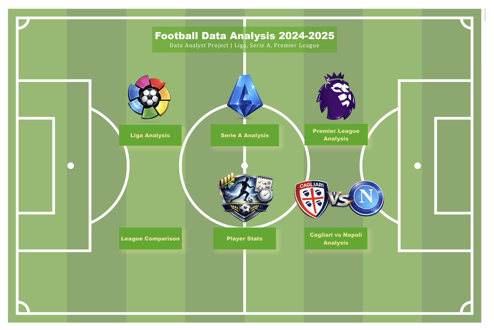
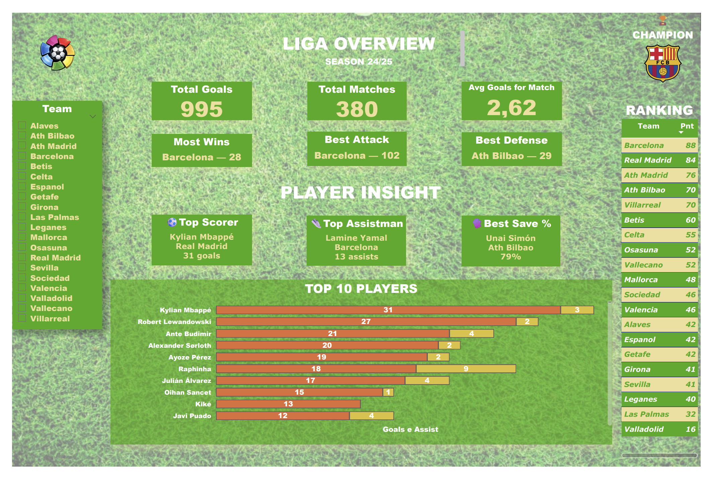
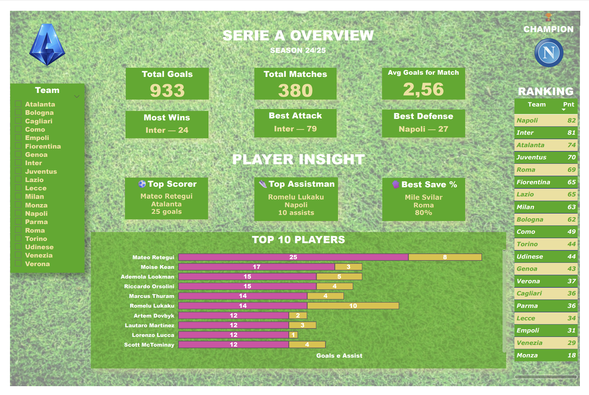
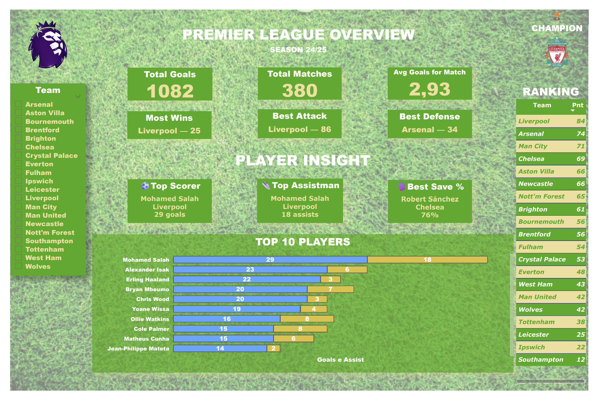
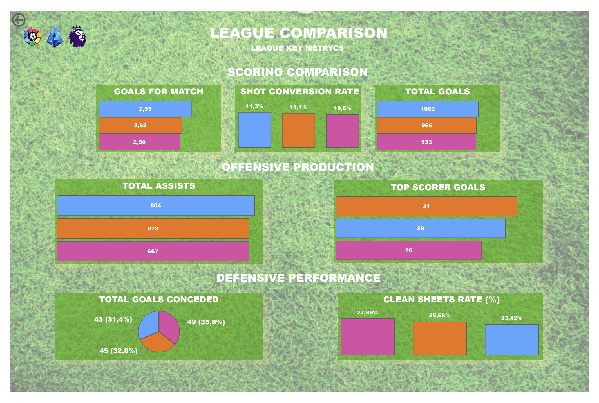
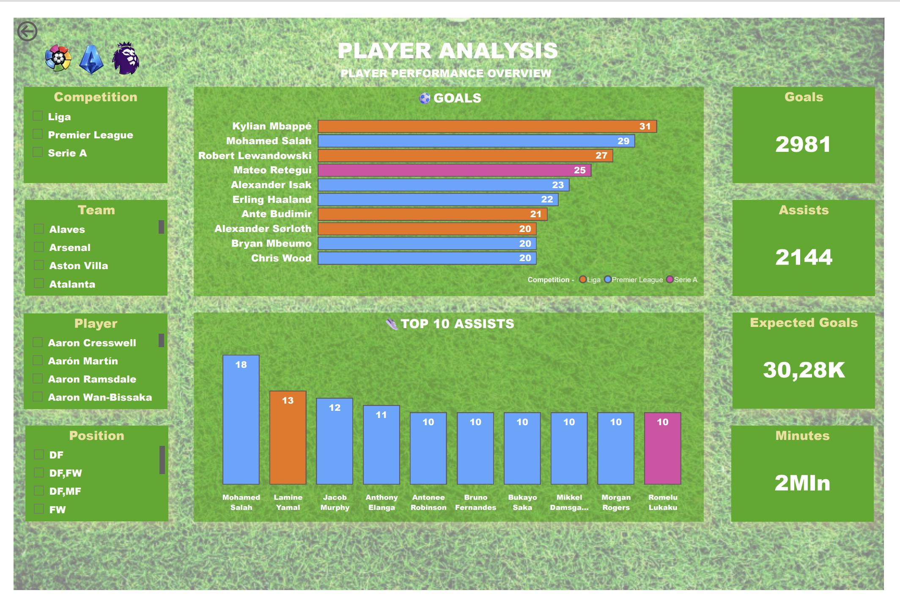
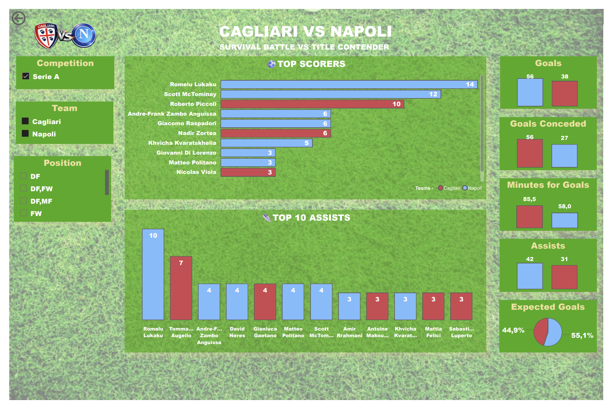

# 📊 Football Data Analysis – Capstone Project (2024–2025)

## 🚀 End-to-End Football Data Analysis Project


---

## Project Overview

This project analyzes football performance across three major European leagues:

* Serie A
* Premier League
* La Liga

The objective is to build a complete data analysis pipeline, starting from raw datasets and producing insights through data cleaning, SQL analysis, and data visualization.

The final result is an interactive Power BI dashboard that allows exploration of team and player performance across the three leagues.

---

## 🎯 Business Objective

The goal of this project is to analyze football performance across major European leagues and identify key trends in:

* offensive and defensive performance
* team efficiency
* player contribution

The analysis aims to transform raw football data into actionable insights through a structured data pipeline.

---

# ⚙️ Technologies Used

This project uses multiple tools typical of a modern data analytics workflow.

### Data Processing

* Python
* Pandas
* Jupyter Notebook

### Database

* MySQL

### Data Visualization

* Power BI

---

# 📂 Project Structure

```
Capstone_football_data_analysis_2024_2025
│
├── data_raw
│   Raw football datasets
│
├── data_clean
│   Cleaned match datasets
│
├── players_raw
│   Original player datasets
│
├── players_clean
│   Cleaned players dataset used in analysis
│
├── notebooks
│   Data cleaning notebooks
│
├── sql
│   SQL queries for analysis and KPIs
│
├── powerbi
│   Power BI dashboard
│
├── images
│   Dashboard screenshots
│
└── docs
    Project documentation and insights
```

---

# 🔄 Data Pipeline

The project follows a structured ETL workflow.

```
Raw Data
   ↓
Python Data Cleaning (Pandas)
   ↓
Clean CSV Datasets
   ↓
MySQL Database
   ↓
SQL KPI Analysis
   ↓
Power BI Dashboard
```

This pipeline allows the transformation of raw football statistics into meaningful analytical insights.

---

## Data Pipeline Diagram


---

# 📈 Key Performance Indicators

Several football performance metrics are analyzed:

* Goals Scored
* Goals Conceded
* Goal Difference
* Win Percentage
* Clean Sheets
* Minutes per Goal
* Top Scorers
* Shot Conversion Rate

These KPIs help evaluate both team performance and player contributions.

---

# 📊 Dashboard

The final dashboard built in Power BI enables interactive analysis of:

* team performance
* league comparisons
* player statistics

Users can explore multiple metrics and compare different teams and competitions.

📄 Full Dashboard (PDF):
[Download Dashboard](PowerBi/football_analytics_dashboard_2024_2025.pdf)

---

# 📊 Dashboard Preview

Below are some screenshots from the Power BI dashboard.

### 🏠 Dashboard Home


### 🇪🇸 La Liga Analysis


### 🇮🇹 Serie A Analysis


### 🏴 Premier League Analysis


### 📊 League Comparison


### 👟 Player Analysis


### 🏟 Cagliari vs Napoli


---

# 📈 Dashboard Insights

A detailed explanation of the dashboard visualizations and KPIs can be found in the documentation:

* 🇬🇧 English → docs/DASHBOARD_INSIGHTS_EN.md
* 🇮🇹 Italian → docs/DASHBOARD_INSIGHTS_IT.md

These documents explain the meaning of each dashboard page and the insights derived from the data.

---

# 📚 Data Sources

The datasets used in this project are derived from publicly available football statistics websites such as:

* FBref
* Football-Data

---

# 💡 Skills Demonstrated

This project demonstrates several core data analyst skills:

* Data Cleaning with Python and Pandas
* SQL Querying and KPI Analysis
* Data Visualization with Power BI
* Analytical Thinking and Data Interpretation
* Building a complete end-to-end data analysis pipeline

---

# 👤 Author

Riccardo Lai
Data Analyst – Epicode Bootcamp

---

# 🎯 Project Goal

This project represents a complete end-to-end data analytics solution, transforming raw football data into meaningful insights through Python, SQL, and Power BI.

It showcases the ability to manage the full data lifecycle: from data extraction and cleaning to analysis and visualization.


---

# 🇮🇹 Analisi Dati Calcio – Progetto Capstone (2024–2025)

## 🚀 Progetto End-to-End di Data Analysis sul Calcio

---

## Panoramica del Progetto

Questo progetto analizza le performance calcistiche di tre principali campionati europei:

* Serie A
* Premier League
* La Liga

L’obiettivo è costruire una pipeline completa di analisi dati, partendo da dataset grezzi fino ad arrivare a insight tramite data cleaning, analisi SQL e visualizzazione dei dati.

Il risultato finale è una dashboard interattiva in Power BI che consente di esplorare le performance di squadre e giocatori nei tre campionati.

---

## 🎯 Obiettivo di Business

L’obiettivo del progetto è analizzare le performance calcistiche nei principali campionati europei e individuare trend significativi in:

* performance offensive e difensive
* efficienza delle squadre
* contributo dei giocatori

L’analisi mira a trasformare dati grezzi in insight utili attraverso una pipeline strutturata.

---

# ⚙️ Tecnologie Utilizzate

Questo progetto utilizza strumenti tipici di un moderno workflow di data analytics.

### Elaborazione Dati

* Python
* Pandas
* Jupyter Notebook

### Database

* MySQL

### Visualizzazione Dati

* Power BI

---

# 📂 Struttura del Progetto

```id="it1"
Capstone_football_data_analysis_2024_2025
│
├── data_raw
│   Dataset grezzi del calcio
│
├── data_clean
│   Dataset delle partite puliti
│
├── players_raw
│   Dataset originali dei giocatori
│
├── players_clean
│   Dataset dei giocatori puliti utilizzati nell’analisi
│
├── notebooks
│   Notebook per il data cleaning
│
├── sql
│   Query SQL per analisi e KPI
│
├── powerbi
│   Dashboard Power BI
│
├── images
│   Screenshot della dashboard
│
└── docs
    Documentazione e insight del progetto
```

---

# 🔄 Pipeline dei Dati

Il progetto segue un workflow ETL strutturato.

```id="it2"
Dati Grezzi
   ↓
Pulizia Dati con Python (Pandas)
   ↓
Dataset CSV Puliti
   ↓
Database MySQL
   ↓
Analisi KPI con SQL
   ↓
Dashboard Power BI
```

Questa pipeline permette di trasformare statistiche calcistiche grezze in insight analitici significativi.

---

# 📈 Indicatori Chiave (KPI)

Sono state analizzate diverse metriche di performance calcistica:

* Goal segnati
* Goal subiti
* Differenza reti
* Percentuale di vittorie
* Clean sheets
* Minuti per goal
* Migliori marcatori
* Conversione tiri

Questi KPI permettono di valutare sia le performance delle squadre sia il contributo dei giocatori.

---

# 📊 Dashboard

La dashboard finale realizzata in Power BI consente un’analisi interattiva di:

* performance delle squadre
* confronto tra campionati
* statistiche dei giocatori

Gli utenti possono esplorare diverse metriche e confrontare squadre e competizioni.

📄 Dashboard completa (PDF):
[Scarica Dashboard](PowerBi/football_analytics_dashboard_2024_2025.pdf)

---

# 📊 Anteprima Dashboard

Di seguito alcuni screenshot della dashboard Power BI.

### 🏠 Dashboard Home


### 🇪🇸 La Liga Analysis


### 🇮🇹 Serie A Analysis


### 🏴 Premier League Analysis


### 📊 League Comparison


### 👟 Player Analysis


### 🏟 Cagliari vs Napoli

---

# 📈 Insight della Dashboard

Una spiegazione dettagliata delle visualizzazioni e dei KPI è disponibile nella documentazione:

* 🇬🇧 Inglese → docs/DASHBOARD_INSIGHTS_EN.md
* 🇮🇹 Italiano → docs/DASHBOARD_INSIGHTS_IT.md

Questi documenti spiegano il significato di ogni pagina della dashboard e gli insight ottenuti.

---

# 📚 Fonti Dati

I dataset utilizzati provengono da fonti pubbliche di statistiche calcistiche come:

* FBref
* Football-Data

---

# 💡 Competenze Dimostrate

Questo progetto dimostra diverse competenze chiave di un Data Analyst:

* Data Cleaning con Python e Pandas
* Query SQL e analisi KPI
* Data Visualization con Power BI
* Pensiero analitico e interpretazione dei dati
* Costruzione di una pipeline completa end-to-end

---

# 👤 Autore

Riccardo Lai
Data Analyst – Epicode Bootcamp

---

# 🎯 Obiettivo del Progetto

Questo progetto rappresenta una soluzione completa di data analytics end-to-end, trasformando dati calcistici grezzi in insight significativi tramite Python, SQL e Power BI.

Dimostra la capacità di gestire l’intero ciclo di vita del dato: dalla raccolta e pulizia fino all’analisi e visualizzazione.
